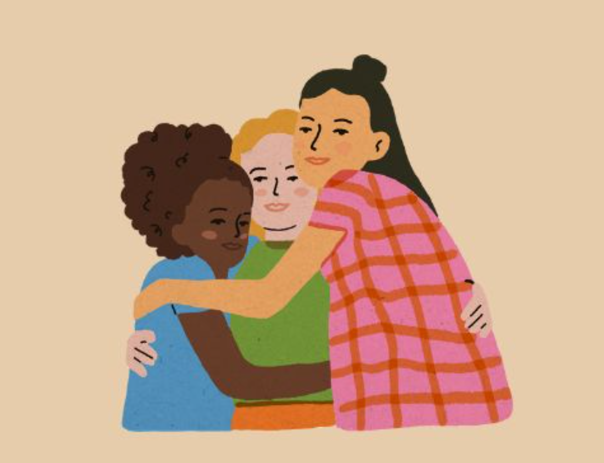

# Ciąża, mózg i siła wsparcia - neurologia bliskości

Mózg potrzebuje ludzi. Tak jak tlenu.
Człowiek jest istotą ultraspołeczną – to nie tylko ładne stwierdzenie z podręcznika psychologii, ale fakt, który widać na poziomie działania naszego mózgu. Bez kontaktu z innymi nie tylko pogarsza się nasze samopoczucie – dosłownie zaczynamy gorzej funkcjonować.

<!-- more -->

Samotność boli. I to dosłownie.
Badania pokazują, że samotność aktywuje te same obszary mózgu co ból fizyczny. Szczególnie zakręt obręczy (ACC), który reaguje zarówno na skaleczenie, jak i emocjonalne odrzucenie. Dodaj do tego ciało migdałowate – odpowiedzialne za lęk i zagrożenie – i masz gotowy przepis na ciągły stan czujności, napięcia i rozdrażnienia.

To nie jest „wrażliwość”. To neurobiologia.
Kiedy jesteśmy sami, nasz układ nerwowy działa inaczej. Pojawia się więcej kortyzolu (hormonu stresu), a mniej dopaminy i serotoniny. Mniej energii na adaptację, więcej energii idzie na przetrwanie.

Dlatego relacje są jak bufor.
Kontakty z innymi regulują napięcie, obniżają stres, pomagają zachować równowagę psychiczną. To może być coś dużego – grupa wsparcia, terapia, bliska przyjaźń – ale też coś małego:

- krótka rozmowa w pracy,

- wiadomość do kogoś, kto „rozumie”,

- spojrzenie, które mówi „też mam dość”.

Szczególnie w trudnych momentach życia – jak ciąża, zmiana pracy, choroba, samotne rodzicielstwo – kontakt z innymi działa jak system bezpieczeństwa. Wspiera. Nie rozwiązuje wszystkiego, ale daje przestrzeń do złapania oddechu.

Sieci wsparcia = codzienna pierwsza pomoc
Nie każda z nas ma dostęp do psychoterapii czy zorganizowanych grup. Ale każda może budować sieci wsparcia – małe, realne, dostępne tu i teraz:

- ktoś, komu możesz wysłać śmiesznego mema,

- sąsiadka, która rzuci „hej, widzę, że masz ciężki dzień”,

- inna mama z osiedla, z którą przejdziesz się z wózkiem.

To wystarczy, żeby nie być z tym wszystkim samą.

Zadbaj o to. Świadomie.
Nie czekaj, aż będziesz miała wolny weekend i idealny nastrój.
Zacznij od drobiazgów. Od wiadomości, od pytania „co u Ciebie?”, od wyjścia z domu na spacer. Daj znać, że jesteś. I pozwól, żeby ktoś był przy Tobie.

## Źródła

[Kalat, J. W. (2019). Biologiczne podstawy psychologii (wyd. 3). Warszawa: Wydawnictwo Naukowe PWN.](https://ksiegarnia.pwn.pl/Biologiczne-podstawy-psychologii,841581572,p.html)

Pąchalska, M. (2007). Neuropsychologia kliniczna: U podstaw diagnozy neuropsychologicznej. Warszawa: Wydawnictwo Naukowe PWN.

Domańska, Ł. (2014). Podstawy neuropsychologii klinicznej. Warszawa: Wydawnictwo Naukowe PWN.

Wojciszke, B. (2024). Psychologia społeczna (wyd. 2, zaktualizowane). Warszawa: Wydawnictwo Naukowe Scholar.

