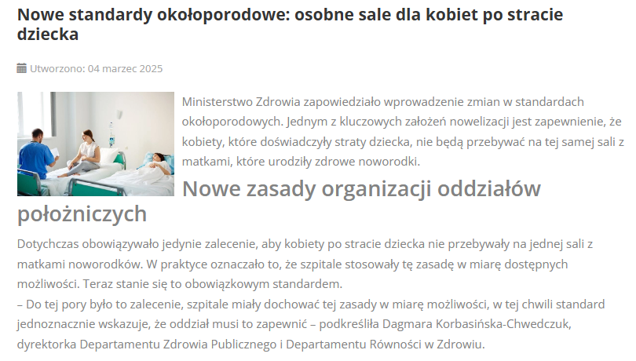

# Nowe standardy opieki okołoporodowej – krok w stronę lepszego wsparcia dla kobiet! ✨

Nowe przepisy mają poprawić opiekę nad kobietami w czasie ciąży, porodu i połogu – nie tylko pod względem medycznym, ale też psychicznym!

<!-- more -->

💡 **Co się zmienia?**

🤍 Kobiety po stracie dziecka **nie będą przebywać na sali z matkami noworodków** – to ważny krok, by minimalizować dodatkowy ból i stres.

🤍 **Wsparcie psychologiczne bez kolejki** – jeśli kobieta tego potrzebuje, pomoc psychologa lub psychiatry będzie dostępna natychmiast.

🤍 Położne będą miały obowiązek **oferowania dodatkowej opieki w połogu** dla kobiet, które straciły dziecko.

📅 Ministerstwo Zdrowia finalizuje prace nad zmianami – jeśli wszystko pójdzie zgodnie z planem, nowe przepisy wejdą w życie już wkrótce!

To ogromnie ważny krok w stronę **bardziej empatycznej opieki** nad kobietami 🤱💞. Zdrowie fizyczne i psychiczne są równie istotne – każda kobieta zasługuje na troskę, zrozumienie i wsparcie!

Co o tym myślicie? Dajcie znać w komentarzach! ⬇️

[Link do artykułu]( https://e-ginekologia.pl/index.php/czytaj-wiecej-interpretacje-prawne/34-gabinet/4328-nowe-standardy-oko%C5%82oporodowe.html)